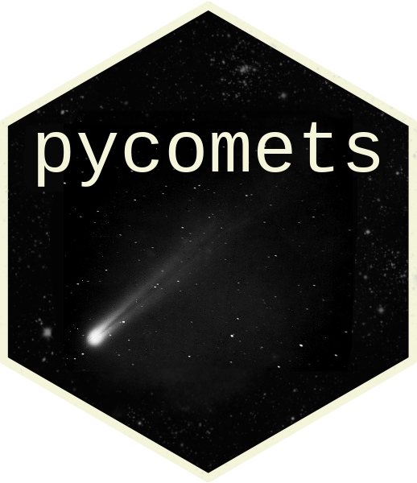

# Covariance Measure Tests (COMETs) in Python 

The Generalised [1] and Projected [2] Covariance Measure tests (GCM, PCM) can be
used to test conditional independence between a real-valued response $Y$ and
features/modalities $X$ given additional features/modalities $Z$ using any
sufficiently predictive supervised learning algorithms. The `pycomets` Python
library implements these covariance measure tests (COMETs) with a user-friendly
interface which allows the user to use any sufficiently predictive supervised
learning algorithm of their choosing. An R version of the package is available
[here](https://github.com/LucasKook/comets).

Here, we showcase how to use `pycomets` with a simple example in which $Y$ is
not independent of $X$ given $Z$. More elaborate examples including conditional
variable significance testing and modality selection on real-world data can be
found in [3].


``` python
n = 150
rng = np.random.default_rng(1)
X = rng.normal(0, 1, (n, 2))
Z = rng.normal(0, 1, (n, 2))
Y = X[:, 0]**2 + Z[:, 1] + rng.normal(0, 1, n)
```

The output for the GCM test, which fails to reject the null hypothesis of
conditional independence in this example, is shown below. The residuals for the
$Y$ on $Z$ and $X$ on $Z$ regressions can be investigated by calling
`pcm.plot()` (not shown here).


``` python
gcm = GCM()
gcm.test(Y, X, Z)
# fig, ax = gcm.plot()
```

```
## 	Generalized covariance measure test
## X-squared = 1.421, df = 2, p-value = 0.491
## alternative hypothesis: true E[cov(Y, X | Z)] is not equal to 0
```

The PCM test can be run likewise. The PCM test correctly rejects the null
hypothesis of conditional independence in this example.


``` python
pcm = PCM()
pcm.test(Y, X, Z, rng=rng)
# fig, ax = pcm.plot()
```

```
## 	Projected covariance measure test
## Z = 3.016, p-value = 0.001
## alternative hypothesis: true E[Y | X, Z] is not equal to E[Y | Z]
```

Different regression methods can supplied for both GCM and PCM tests using the
`reg_*` arguments (for instance, `reg_YonZ` in `PCM().test()` for the regression
of $Y$ on $Z$). Pre-implemented regressions can be found in the `regression`
module and include regression forests (`RF`), classification forests (`RFC`),
the linear model (`LM`), cross-validated kernel ridge regression (`KRR`), and
regression and classification Xgboost (`XGB`, `XGBC`). For instance, in the
code chunk below, we use a KRR for both $Y$ on $Z$ and $X$ on $Z$ with different
kernel choices and grids for hyperparameter tuning.


``` python
gcm = GCM()
gcm.test(Y, X, Z,
         KRR(kernel="rbf", param_grid={'alpha': [0.1, 1, 10]}),
         KRR(param_grid={'kernel': ('linear', 'rbf'), 'alpha': [0.1, 1]}))
```

```
## 	Generalized covariance measure test
## X-squared = 1.519, df = 2, p-value = 0.468
## alternative hypothesis: true E[cov(Y, X | Z)] is not equal to 0
```

# Installation

The development version of `pycomets` can be installed from github:

```python
pip install git+https://github.com/shimenghuang/pycomets.git
```

or by cloning the repository and installing it in editable mode:

```python
git clone https://github.com/shimenghuang/pycomets.git
cd pycomets
pip install -e .
```

<!-- A stable version of `pycomets` can be installed from PyPI via: -->

<!-- ```python -->
<!-- pip install pycomets -->
<!-- ``` -->

# References

[1] Rajen D. Shah, Jonas Peters "The hardness of conditional independence
testing and the generalised covariance measure," The Annals of Statistics,
48(3), 1514-1538. [doi:10.1214/19-aos1857](https://doi.org/10.1214/19-aos1857)

[2] Lundborg, A. R., Kim, I., Shah, R. D., & Samworth, R. J. (2024). The
Projected Covariance Measure for assumption-lean variable significance testing.
The Annals of Statistics, 52(6), 2851-2878.
[doi:10.1214/24-AOS2447](https://doi.org/10.1214/24-AOS2447)

[3] Kook, L. & Lundborg A. R. (2024). Algorithm-agnostic significance
testing in supervised learning with multimodal data. 
Briefings in Bioinformatics 25(6) 2024. 
[doi:10.1093/bib/bbae475](https://doi.org/10.1093/bib/bbae475)
